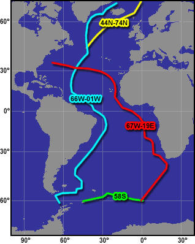

# GEOSECS

## Data Downloads

* {download}`GEOSECS Data in NOAA SD2 ASCII Format <_downloads/entire_geosecs_atl_sd2.7z>`
* {download}`GEOSECS Data in JOA binary Format <_downloads/entire_geosecs_atl_joa.7z>`

## Data Descriptions

:sd2: A19726NE.TXT
:joa: natl.1972.6N.44N_74N.joa
:ship: Knorr - GeoSECS

A section of 10 stations from 44.96 degrees North to 74.933 degrees North, 42.076 degrees West to 0.008 degrees West. All have temperature, salinity. Most have oxygen, phosphate, silicate. None have nitrate. There are at least 9 full depth casts.

---

:sd2: B19726NA.TXT
:joa: satl.1972-73.6N.66W_1W.joa
:ship: Knorr - GeoSECS

A section of 61 stations from 61.05 degrees South to 74.933 degrees North, 66.133 degrees West to 1.121 degrees West. All have temperature, salinity. Most have oxygen, phosphate, silicate. None have nitrate. There are at least 60 full depth casts.

---

:sd2: B19736NB.TXT
:joa: satl.1973.6N.67W_19E.joa
:ship: Knorr - GeoSECS

A section of 28 stations from 60.025 degrees South to 35.99 degrees North, 67.983 degrees West to 19.396 degrees East. All have temperature, salinity. Most have oxygen, phosphate, silicate. None have nitrate. There are at least 25 full depth casts.

---

:sd2: B19736NA.TXT
:joa: satl.1973.6N.58S.joa
:ship: Knorr - GeoSECS

A section of 11 stations along 58S, 45.033 degrees West to 0.025 degrees East. All have temperature, salinity, oxygen, phosphate, silicate. None have nitrate. There are at least 9 full depth casts.