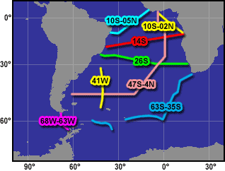

# SAVE Atlantic Set



## Data Downloads

* {download}`SAVE Data in NOAA SD2 ASCII Format <_downloads/save_sd2.7z>`
* {download}`SAVE Data in JOA binary Format <_downloads/save_joa.7z>`

## Data Listing

```{include} _includes/_save
```