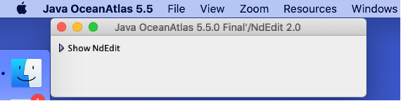
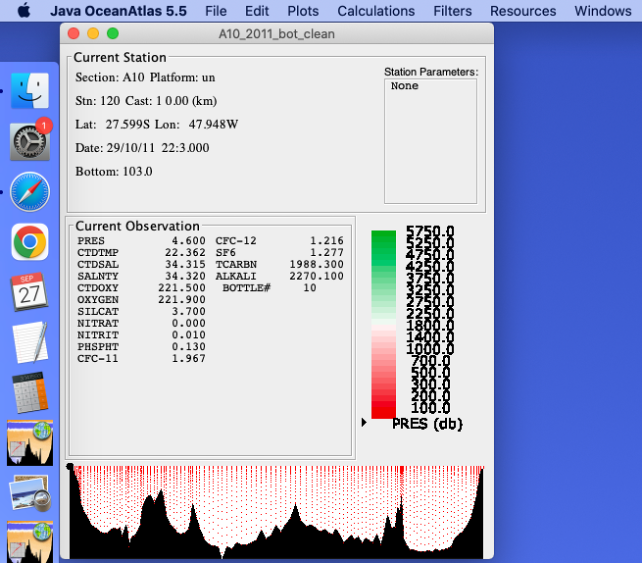

# Mac Installation Instructions

04 DEC 2025

To install JOA on a MacOS computer, we now recommend only and exactly the method described here.

Java OceanAtlas (JOA) is a safe, well-behaved application, used successfully by hundreds of users.
Apple has, however, made it increasingly difficult to install independently-developed applications in macOS.
We hope to have an Apple-sanctioned version of JOA at some point, but for now you must figuratively jump through some hoops to install and use JOA on most macOS computers.
Many thanks to SIO data specialist and developer Andrew Barna, who came up with this macOS JOA installation method.

[Windows users are not reporting installation problems with the on-line instructions.]

* You do not have to install a separate Java environment for JOA 5.5
* We presently support JOA 5.5 installation on macOS 10.15 and higher. (We have not yet verified the installation process for macOS 26 and higher, but it is likely that it will work for macOS 26.1, the official highest version as of the date of these instructions. To check what version of macOS is installed on your computer, go to the Apple menu in the top left corner of your screen and select "About This Mac".) 
* The only difference between the regular and 'pro' versions of JOA is that the 'pro' version is capable of handling the largest all-globe World Ocean Atlas 3-D gridded data file but requires at least 16 GB of installed RAM. The regular version requires only 4 GB of RAM.

:::{important}
The installation process works only for the "administrator" of a macOS computer. Most users are their own administrator, but if, for example, your computer was provided to you by an entity which owns and set up the computer for you, the system administrator of that entity must do at least step #4, using their password.
:::

* Please follow the instructions exactly. Many macOS JOA installation failures stem from mistakes in following the instructions.

Please report installation problems to the JOA developer John "Oz" Osborne (tooz@oceanatlas.com) and/or to Jim Swift (jswift@ucsd.edu).

## Installation on macOS 10.15 and higher
1. Using a browser, download either the "standard" or "pro" version of JOA 5.5. We used Chrome in testing, but we think any standard macOS browser should work. (The "pro" version requires at least 16 GB of installed RAM. The standard version requires only 4 GB of RAM. They have identical features and operation.)
   * [Download macOS 10.15 STANDARD JOA 5.5 (126.8 MB)](https://cchdo.ucsd.edu/data/22051/JOA5.5.zip)
   * [Download macOS 10.15 PRO JOA 5.5.1 (127.6 MB)](https://cchdo.ucsd.edu/data/24533/JOA5.5.1_Pro.zip)
  
1. When the download is finished, if your browser did not automatically unzip the downloaded JOA Zip file, then you should unzip it, keeping the unzipped folder in your downloads directory.
1. There will now be a folder called "Java OceanAtlas" in your downloads folder that contains these files:

   

1. Open the Terminal application. (It should be in the Utilities folder in the Applications folder on your macOS computer.)
   Type (or copy and paste) this exact text string into the Terminal window (please note the space character before "OceanAtlas"):
   ```console
   sudo xattr -c -r ~/Downloads/Java\ OceanAtlas
   ```

   Hit "return" and the computer will ask you for your password (the password you use to start-up your Mac), which you should provide. [See the note above about system administrators.]

1. Next, right click (or control click) the Java OceanAtlas 5.5 app, selecting -> "Open". 

   :::{note}
   The "right/control-click" step was suggested by the developer. We think that simply double-clicking on the Java OceanAtlas 5.5 app icon to open it may also work because some users report that double-clicking on the icon for the Java OceanAtlas app worked fine for them.
   :::

1. JOA should launch without issue at this point. It may ask for permission to see the downloads directory which you should grant.

   Here is what you should see:

   

JOA is now running on your macOS computer, and is ready for you to use it. The JOA folder can now be moved where you wish on your computer, such as to the Applications folder or your Desktop. 
:::{note}
Keep the "Java OceanAtlas" folder contents together. In particular, the "JOA_Support" directory must be in the same folder as the "Java OceanAtlas 5.5" application.
:::

If you would like to get started using JOA, or want to do one more operational check, use the JOA "Open..." command, under the JOA "File" menu, to open one of the example data files in the JOA folder. For example, if you open example data file "A10_2011_bot_clean.joa" in JOA, you should see this on your computer screen:



Have fun! Pull down the Plots menu and try a plot. [[The JOA Guided Tour](../guided_tour/basic_features.md) provides information on using JOA.]

## Fixing Blurry Fonts in JOA
If you are using Mojave or Catalina, you may notice certain text to be poorly rendered and difficult to read, such as colorbar labels. To fix this, you need to change a setting on your mac by executing a command in the Terminal application.


1. Quit JOA. Open Terminal (Terminal can be found in your /Applications/Utilities/ folder). You will see some text in your Terminal window. The gray box is your cursor.
1. Copy and paste the following text into Terminal and press return: 
   ```console
   defaults write -g CGFontRenderingFontSmoothingDisabled -bool NO
   ```
   You should now see the text to the right of the % symbol shown in this example:
    
1. After you press return, a new line of text with your computer and account name will appear. There will be nothing to indicate that a change has taken effect. Quit terminal and restart JOA. If text still appears fuzzy, try logging out of your account and logging back on.