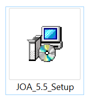
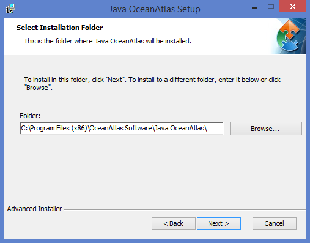
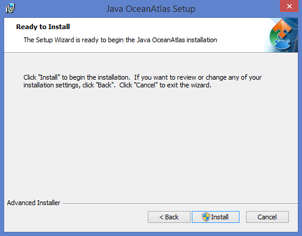
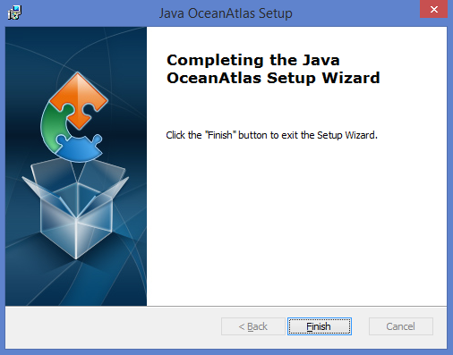

# Windows Installation Instructions 

## Installation

After downloading, just double-click installer icon to begin installation process:

You will be presented with a series of dialogs to guide you through the installation process: 

Select an installation folder if different than the default: 

Click Install to install JOA onto your PC: 

Click Finish at the end of the installation process: 

## Windows System Requirements
* JOA 5.5: Microsoft Windows 10 but should work on versions of Windows back to version 7.
* JOA 5.3: Microsoft Windows 8 or 8.1 (not tested under Windows 10)
* 4 GB of RAM (JOA 5.5 standard version, earlier versions of JOA) or 16 GB of RAM (JOA 5.5 pro version) 