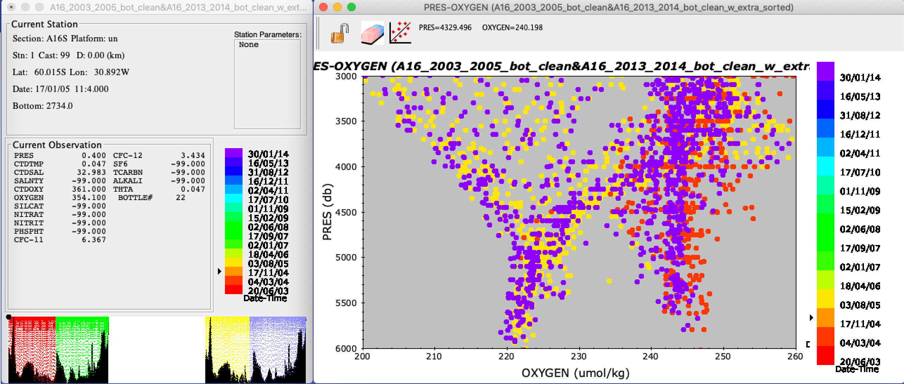
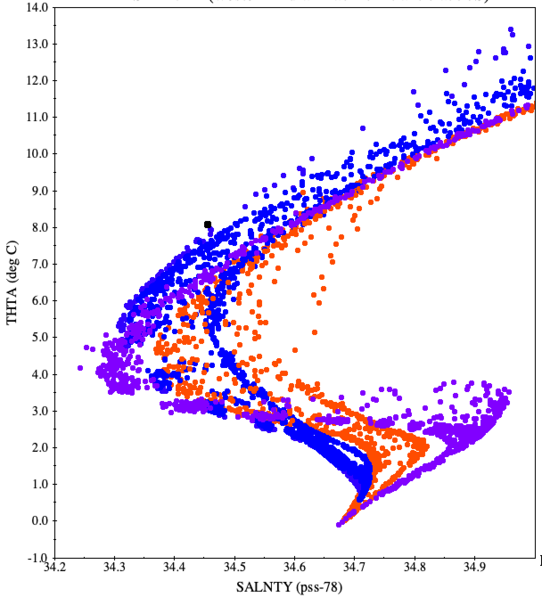
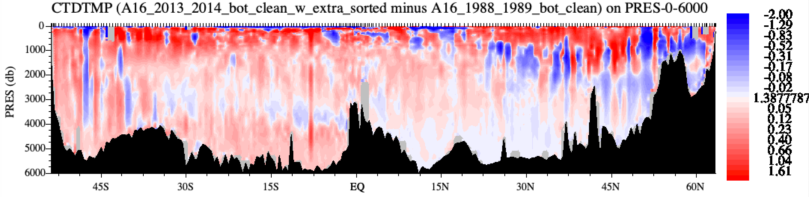
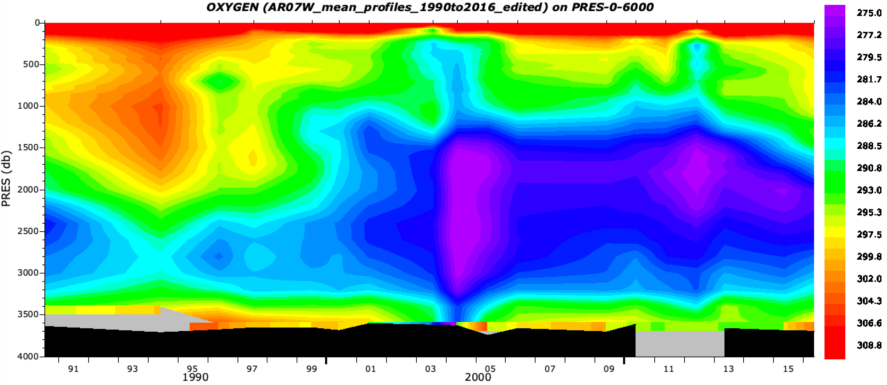

# Comparing Multiple Data Files Using Java OceanAtlas (JOA)

James H. Swift, UCSD Scripps Institution of Oceanography
version of September 2021

```{note}
This document refers occasionally to several JOA features which may or may not be enabled in a given installation of JOA.
To enable a missing feature, go to Preferences, under the JOA menu, then horizontal-select-scroll right to "Feature Management" in the Configure Preferences dialog box and vertical-scroll through the list of selectable JOA features to enable a desired feature which does not show up in your present installation of JOA.
```

## Introduction
There are many instances when an oceanographer wishes to compare data from two or more profile data files or different collections of profile data, for example to compare data from different regions or times.
How does one go about comparing the CTD or water sample data from two or more data files?

```{note}
In the context of this document, a data file is a single ascii or binary file containing data from one or more vertical profiles.
For example, a data file could contain bottle or CTD data from one oceanographic station (e.g., "Station 89"), or all the stations from a cruise or transect (e.g., "I08S_2007"), or from a region of the ocean (e.g., "NE Indian Ocean"), or any other combination of vertical profiles.
```

One obvious way to compare data from different data files is to separately make the same plot for each data file and compare the two plots.
In physical oceanography these plots might be similarly-prepared X-Y plots, vertical sections, or maps of the data or of parameters calculated from the data, one plot for each file.
But Java OceanAtlas (JOA), as a graphics-oriented data display and exploration application, offers routes to other instructive data comparison mechanisms as well, in addition to plots made by opening data files individually (one JOA data window per data file): opening data files together (one JOA data window for all data files), subtracting one data file from another (which makes a third JOA data window - the differences - from two other data files), and making mean (weighted average) profiles from each data file and comparing the mean profiles.
Also, results of similar calculations carried out separately on two or more data files can be exported from JOA and then combined to be compared tabularly, or graphed using other applications.

## Comparing data by opening data files individually (one JOA data window per data file)

Using the JOA "Open..." command (under the JOA File menu) repeatedly, one may have as many JOA data files open (one data file per data window) as one wishes.
[One may also drag-and-drop JOA binary files - .joa files - onto the JOA application icon. JOA will then open each file into its own data window.]

To graphically compare the data from the files, one makes the same plot from each data file. In a sense, that's it, but there are practical issues to consider:

* It can be difficult to track which plot is associated with which data window. One can keep track via the JOA Windows menu, which lists every open data window and plot, any one of which can be selected as the front-most window.
  Referral to and use of the JOA Windows menu when multiple data sets are open is recommended.
* Careful naming of each plot can be helpful (via the dialog box used to create the plot).
* When multiple data files are open in JOA, and when a new plot is being made, it is recommended that the data window for the intended data file be the front-most JOA window.
  [JOA uses the data from the data window hosting the data from the front-most JOA window, whether that window itself is a plot or the data window, so it is not strictly necessary that the data window itself be the front window.
  But it helps to reduce confusion when the intended data window is the front-most window at the time the plot is generated.]
* Be certain that plot details are set identically for the plots to be compared.
  Left to its own, JOA will autoscale plots and use the color bar in the data window to color points on X-Y plots. Customizing and matching ranges, scales, and, if necessary, color bars, can be essential to ensure that plots from different data windows are being fairly compared.

## Comparing data by exporting data or calculation results from data files opened individually (one JOA data window per data file) and examined or plotted with other applications
JOA's plotting capabilities are (mostly) restricted to the data and calculation results in one JOA data window. (The exception is JOA Section Calculations, available under the JOA Calculations menu when at least two data files - at least two data windows - are open.) Therefore, when one wishes to make a single plot from data or calculation results from more than one data window, another approach is required. For such instances (and other purposes as well) JOA supports the export (via the JOA File menu) of data and calculation results along with metadata such as date, latitude, longitude, etc. The exported files can then be combined in an appropriate application, such as Excel or a graphics application, where plots combining the data or calculation results can be made.

For example, consider (and try this!) how one might compare dissolved oxygen in the 1000- 2000 db layer along the A16 Atlantic Ocean meridional track from 60°S to Iceland from two different time periods, in this case using occupations during 2003-2005 and 2013-2014. The 2003-2005 and 2013-2014 data sets would be opened separately in JOA, and then for each the JOA Station Calculations functions would be used to calculate the weighted mean dissolved oxygen over 1000-2000 db (via the Station Calculations ... Integration submenu under the JOA Calculations menu) for each data file. Then the Export Station Calculations function (under the JOA File menu) would be used to export the results for all stations (by using the check-all button), again for the 2003-2005 and 2013-2014 data files separately. This would yield an ascii file for each data set, here "A16_2003_2005_bot_clean.stncalcs" and "A16_2013_2014_bot_clean.stncalcs". The suffix "stncalcs" is not recognizable by most applications, but "stncalcs" files are actually ascii tab-delimited text files so they can simply have their suffix changed, for example to "A16_2003_2005_bot_clean_stncalcs.txt", which can then be opened by many applications. In the figure below, the JOA station calculations for the 1000-2000 db weighted mean oxygen for all the stations from A16 2003-2005 and for A16 2013-2014 were exported, the exported file suffixes were changed to .txt, the files were opened in a graphics application, and the values for the two time periods were plotted against latitude on a single plot (JOA can make similar plots but only for one data file at a time):

```{figure} _static/comparing/figure_1.webp
:alt: scatter plot of oxygen vs latitude for two different cruises

Weighted mean dissolved oxygen from 1000-2000 decibars along Atlantic meridional section A16 from 2003-2005 (blue) and 2013-2014 (red) plotted against latitude. Note that values are generally lower in 2013-2014 for data from the Southern Hemisphere.
The data were plotted using the KaleidaGraph application working from calculation results exported from Java OceanAtlas.
```

This example hints at a broad potential represented by combining JOA's range of calculation capabilities over multiple data sets with JOA's ability to export the results of those calculations in ascii files which can then be imported into a graphics-capable application (such as a spreadsheet) where the results can be combined and plotted.

## Comparing data by opening data files together (one JOA data window for all data files)
After one data file is open in JOA, using the JOA "Add Data..." command (under the JOA File menu) will add (concatenate) data files. [Adding cannot be accomplished by dragging and dropping JOA binary data files onto the JOA application icon.] As many data files as one wishes may be added, one at a time. JOA will show all the data files together in one data window, in essence subsequently treating the added data as one data file. Each calculation made will be applied to all of the data files in the data window. (It is best to carry out any JOA calculations after one has added all the intended data files the data window.)

Each plot made will draw from the entire set of added data files. There are JOA features which can aid plot interpretation when data files are added:

* For multiple data files which are separated in time - for example two or more transects across the same region at different times or data from a time series station - X-Y (property-property) plots can be colored with the "Date_Time_Rainbow_32_cbr.xml" color bar, which will auto-range with the date-time range of all the data in the data window. (Remember, the data points on a JOA X-Y plot are colored by the color bar in the data window, which can be changed by selecting a color bar from the JOA Contour Manager, accessed from the JOA Resources menu. "Date_Time_Rainbow_32_cbr.xml" is the choice discussed here.) For example, coloring a dissolved oxygen versus pressure plot with this color bar, when two or more cruises from different years are open in one data window, will color the dots from each cruise with a different color, shown here for the deep water range of the A16 2003-2005 and 2013-2014 data files (note the suggestion of a small deoxygenation in the interval between the cruises):

  

  This is a handy, easy bulk method of comparing data sets separated in time, when they are opened ("added") in one JOA data window.

  Similarly, for data files which are separated in position - for example data sets from different regions - X-Y (property-property) plots can be colored with the Latitude or Longitude color bars, which will auto-range with the latitude (or longitude) range of all the data in the data window. JOA also supports choice of auto-ranged color bars by month or season.
* Stations (profiles) of interest can be isolated on plots by use of JOA station filters ("Station filter..." under the JOA Filters menu). For example, one might wish to compare station xxx from cruise A with station yyy from cruise B, when both A and B are opened into s single JOA data window. Using command-click on the list of stations in the Station Filters dialog box, stations xxx and yyy can be selected, and made the only "included" stations on all open and future plots. [The station filter can be removed when no longer wanted.] This technique will work to examine plots restricted to whatever selected stations one wishes, from single or multiple data files open in the data window. For example, one can make a multiple-X-axis property-property plot (by command-clicking on up to seven X-axis choices in the property-property plot dialog box), which may initially be messy, but then use the filters to focus on just 2-3 profiles.

In the illustration below, we have combined data files, all along 30°S, from the western South Atlantic, South Indian, and South Pacific oceans. Then we calculated potential temperature, plotted potential temperature versus salinity (adjusting the axis ranges somewhat), and colored the dots via a color bar which permits differentiation of the three oceans, here with purple for the western Atlantic data, orange for the western Indian data, and blue for the western Pacific data:




Subtracting one data file from another (making a third JOA data window from two other, coincident or at least overlapping data files)

When geographically coincident section-oriented data files are open in separate JOA data windows, two of them can be combined using the "Combine Sections..." choice from "Section Calculations..." under the JOA Calculations menu. The Combine Sections dialog box is used to make a new data file (found in a new data window) and offers the choice of subtracting or adding the sections. (Subtraction is the operator to use - there is little to be learned from adding data.)

To use the subtraction feature, one chooses which section (data file) will be subtracted from which, and types in the name for the result in what will be the new data window for the result (or this will be auto-named), how the data from each sections should be interpolated before subtracting (a common example: on pressure surfaces such as PRES-0- 6000_srf.xml, which is 63 levels from 0-6000 decibars), and how the data should be gridded both in terms of following latitude or longitude (whichever makes sense for the files being subtracted, such as using latitude for subtracting one meridional section from another), and in terms of which station locations, A or B, will be the master for the latitude- or longitude-oriented grid.

This is a powerful and yet potentially confusing way to compare overlapping sections. There are issues to consider when using this JOA feature:

* The data sets to be subtracted, one from the other, must be geographically coincident, although not literally or absolutely - "two of a kind" may be a useful way to think about coincidence. For example, two occupations of the same transect, following nearly the same paths, but not necessarily the same station positions, would be an ideal pair for comparing via subtraction. Data which fall outside the overlap in either latitude or longitude (whichever is chosen for the operation) will automatically be ignored by JOA when it carries out the subtraction.
* The station locations in data file A need not be identical to those in data file B, but for the subtraction to work properly JOA will internally make one set of the overlap literally lie on top of the other in either latitude or longitude. To accomplish this, the user chooses to "Regrid A to B" or to "Regrid B to A", and whether this will be done by latitude (used for meridional [south-north] sections or by longitude (used for zonal [west-east] sections). Note that what is happening in "Regrid A to B" is that JOA will internally create a new data file from the cruise A data that exactly matches the latitudes or longitudes of cruise B stations by linearly interpolating the cruise A data horizontally to the latitudes or longitudes of the cruise B stations.
* If one of the sections extends longer than the other, JOA will automatically take care of this by considering only the stations that overlap and ignoring extra stations at either end. But note that if the user runs into problems suspected to arise from unequal-length sections, it is possible to use the station filter command to filter and save a station subset that matches the companion section. (Remember to save the filtered data set and then open and use the filtered one.)
* To subtract one station from the other horizontally interpolated onto it, JOA must vertically interpolate both stations to the same set of standard surfaces. The interpolation surface for this vertical regridding is chosen in the Combine Sections dialog box. A set of standard pressure surfaces (e.g., "PRES-0-6000_srf.xml") is the most common choice, but any set of standard surfaces can be used. [Note: carefully examine for reasonableness your subtracted-data results after using vertical regridding onto any surfaces other than pressure. Surprises do happen.]
* When one has gone through all the set-up for subtracting sections, clicking "OK" in the Combine Sections dialog box will create a new section with station locations either "A" or "B" based on the choice of which section is regridded to the other. The new section will extend throughout the overlapping portion of the two sections. The data values for each "Current observation" parameter in the data window (except for pressure when vertical regridding is done by interpolation onto pressure surfaces, as is usual) will be the difference in that parameter at that level between the two data sets.

```{warning}

It is strongly advised that one carefully examine the signs of the calculated differences at sufficient locations (usually only one is needed) along the new "difference" section to assure that the sign of the differences is correct. In other words, directly compare the original data from both data files at a point as close as possible to the same location and level to see which values are larger. Is the sign of the difference correct? It may seem odd that the user is advised to check this, but experience shows that sometimes a difference section has the signs of the differences the opposite of what the user expected.

[We have also heard from users who have found anomalies in the subtraction results when original station latitudes (for meridional sections) or longitudes (for zonal sections) are literally identical for at least some station pairs from both data files. (If true, this is a bug, and should be reported.) A work-around, when all else fails and the need is urgent, is to note the numbers of the offending exact-position-overlap stations, open one of the data files in JOA, use the JOA File Properties editor, under the JOA Edit dialog box, to very slightly change and save their now-revised positions (latitude for meridional sections or longitude for zonal sections) of the exact-position-overlap stations. (The goal is only to assure positions that are not literally identical for the offending station pairs.) This is time consuming but will get the job done when one's circumstances are demanding.]
```

```{note}
The standard color bars will not work well for coloring the parameters in a section created by subtracting one from the other. For example, CTDTMP is now the difference in CTDTMP. One can make a new color bar appropriate to the differences. [We plan to supply color bars "TEMP-difference small_cbr.xml", "TEMP- difference_cbr.xml", "SALT-difference_small_cbr.xml", "SALT-difference_cbr.xml", "SALT-difference-wide_cbr.xml", and "O2-diff_cbr.xml". These would be appropriate for the examinations of subtracted sections discussed here.]
```

Because JOA carries out only simple linear interpolations over the closest data points (i.e. JOA does not use objective analysis techniques), contour plotting a difference section may produce spotty, uneven results. Therefore, in general, one should examine the big picture, so to speak, over the details.

Below we show an example of temperature difference plotted for a pair of overlapping meridional sections, in this case the 1988-1989 A16 occupation subtracted from the 2013- 2014 A16 occupation, illustrating patterns of ocean temperature change (mostly warming) over 25 years:




## Comparing data from multiple data files by making mean (averaged) profiles from each data set and then plotting the results after concatenating the mean profiles
When one concatenates data files via JOA's "Add data" command under the JOA File menu (for example files from different regions or files from different cruises from the same region), and then makes a X-Y (property-property), the resulting scatter plot may be interesting. But sometimes one prefers more of an each-data-set-as-a-whole approach. JOA offers mean cast calculation capabilities which support that approach.

Open each data file separately (each in its own data window), and for each use the JOA Mean Cast section calculation (via the Section Calculations submenu under the JOA Calculations menu), choosing the same interpolation surfaces (typically PRES-0-6000) for each. Save each new mean profile data file as a JOA binary (.joa) file with an appropriate file name. Then open one of the saved averaged profiles (the new, saved .joa files) and, one by one, add the others to it using the "Add Data..." command under the JOA File menu. If examining data collected from the same area over different times, we suggest adding them from oldest to newest, resulting in a new data window now containing a time series of mean profiles. Use any JOA plotting or calculation capability to explore the result. (Note that the newest versions of JOA also calculate means of the data file metadata - such as mean date and mean position - so plotting against time should work OK.)

This can be a powerful way to examine data. For example, the vertical section we show below is a contoured time series of mean oxygen profiles for the AR07W Canada to Greenland section, from 1990 to 2016, plotted using JOA, with time as the X-axis, using a customized dissolved oxygen color bar:


