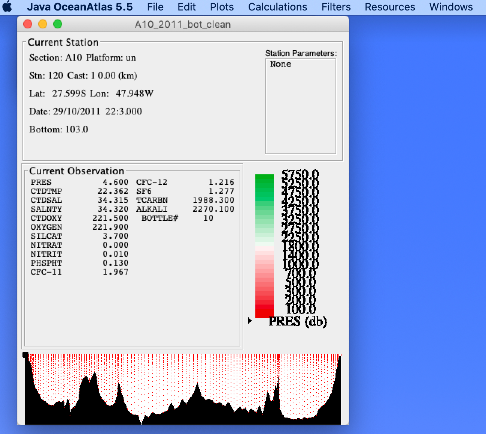
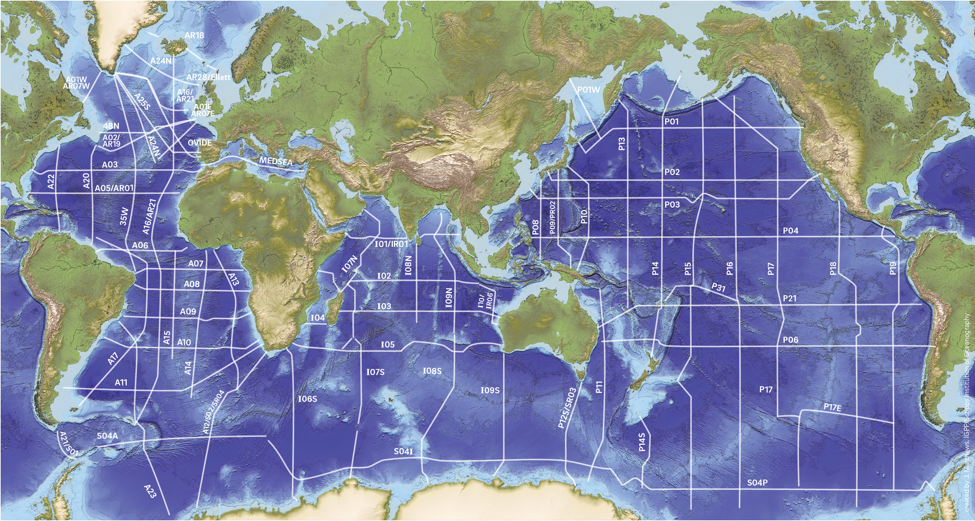
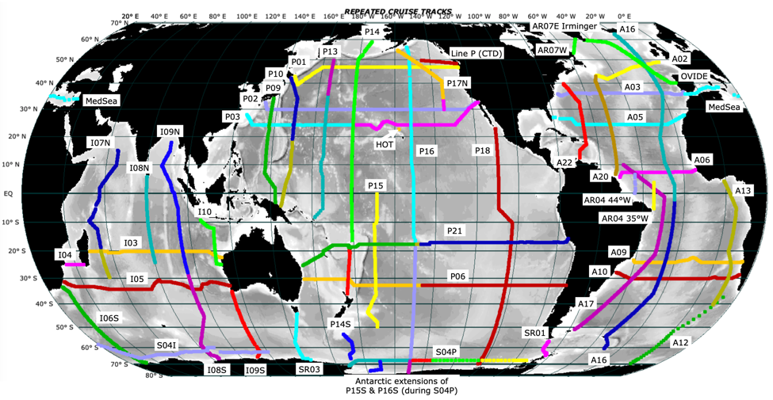
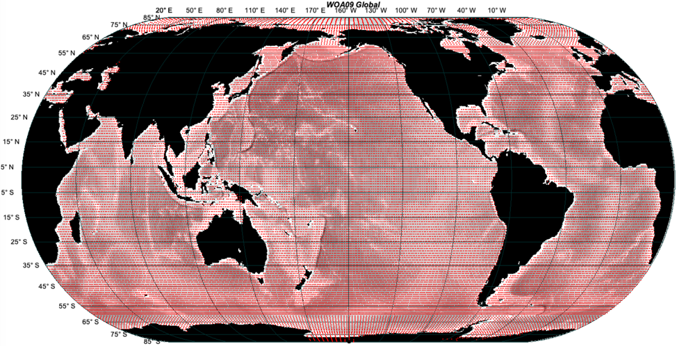

# Guide to Data Analysis Projects
(Use of Java OceanAtlas is described, but other apps, e.g., Ocean Data View, may be equally appropriate)

James H. Swift, UCSD Scripps Institution of Oceanography version 2, September 2022

Personal note: I have enjoyed a career of working on the oceans, spending a little over three years of my life at sea.
I was part of a team measuring the properties (temperature, salinity, dissolved oxygen, nutrients, ocean carbon parameters, CFCs, etc.) of the water column at the spatial scales represented by the great trans-ocean physical oceanography expeditions, and at the time scales associated with the years to decades between repeat occupations of some of these transects.
Interpretation of these large-scale distributions of water properties and their variability form an essential component of descriptive physical oceanography and ocean climate science.

## What are hydrographic data analysis projects?
It has become feasible for students and others to explore the physical oceanography of the oceans - the oceanic water masses and their circulation - in a professional manner using actual data from oceanographic expeditions.
This document is meant to assist a student undertaking a data analysis project using water property ("hydrographic") data to explore some aspect of the physical ocean by examining water column data from water samples.
I assume readers have either had an introduction to descriptive physical oceanography, or perhaps are currently taking a course in that subject.
The approach here introduces students to examination of hydrographic data, with the aim of learning about the oceans.

## Application support for data analysis projects
In this document I describe use of Java OceanAtlas (JOA), a free interactive data exploration and plotting application for MacOS and Windows, because I am familiar with it.
I and developer John "Oz" Osborne designed JOA to facilitate exploration of data at basin- spanning and global scales.
JOA works well for data analysis projects aimed at these scales. Another reason for the large-scale focus is that it lies at the heart of descriptive physical oceanography.
However, JOA use is not required.
Some students prefer to use Ocean Data View (ODV) which works well with most of the data files described here), Excel, Matlab, etc.

## Notes about installing JOA
For those who choose to use JOA, I emphasize the value of early-on downloading and installing [JOA](../../joa/index.md) (following the on-line instructions), and then doing the [JOA Guided Tour](../../joa/guided_tour/basic_features.md).
The Guided Tour not only will provide much of what is needed to get started with JOA and a data analysis project, but it also may help one's comprehension of some of the lectures in an introductory course in physical oceanography.

To download JOA onto computer, see the application area of the [Java OceanAtlas Suite web site](../../joa/index.md) and exactly follow the installation instructions for your computer operating system.

By the way, the only difference between the regular and "pro" versions of JOA 5.5 is that the pro version requires at least 16 GB RAM. The pro versions are needed only if you plan to work with the largest global data files on the JOA Suite data site, for example the 217 MB global 1-degree gridded file "WOA18_annual_decimated_all_102_levels_mass.jos".

To test that JOA is installed correctly, open Java OceanAtlas (by double-clicking on its icon), and after JOA has started, use the JOA "Open ..." command, under the JOA File menu, to open one of the example data files in the JOA folder on your hard drive. You should then see something like the screenshot image below.



It is strongly recommended that JOA users first become familiar with JOA terminology and functions via the [JOA Guided Tour](../../joa/guided_tour/basic_features.md).

## How to carry out a hydrographic data analysis project using the JOA Suite
Undertaking a hydrographic data project involves these key steps:

* Choose some aspect of the physical ocean to examine with water column data from water samples. Often students work with teachers, their advisers, or other mentors to choose a project focus. This should include a rough plan of approach, and consider what data are needed (see later in this document for sample project ideas).
* If you will use JOA, download and install JOA on a Windows or MacOS computer. See [](../../joa/index.md).
* Go through the JOA Guided Tour. This not only gets you started with JOA, but also covers some basic physical oceanography.
* If you are not using JOA, develop a plan for what tools you will use. For example see <https://odv.awi.de> for ODV.
* Locate and download data of interest to your goals. There is a large library of curated data in binary and ascii formats available at [the data homepage](../../data/index.md).
  The ascii "_hy1.csv" files should work equally well with JOA and ODV. The ".joa" or ".jos" files will work only with JOA.
* Start playing with your data. Have fun. Explore the ocean. Observe. Learn.
* Meanwhile, do a bit of additional reference reading related to your project.
* That's pretty much it except for the writing (and making figures for your report).

A project report might consist of the following:

* A brief introduction which lays out scientific background and your intent, perhaps with a reference or two.
* A very brief presentation of data and methods.
* A results section where with figures and text you describe and illustrate the raw results of your work (not everything you tried or did, but the part relevant to your report).
  What did you find?
* A short discussion where you interpret your findings in some relevant context.
* A conclusion (can be part of the discussion) which relates your results/findings to your intent/goals.
* A reference list covering any cited references.

To get figures into a report, consider pasting screen captures.
Sometimes it is worthwhile to first paste them into PowerPoint (or equivalent) to annotate them or whatever.
Before copying a figure, considering using JOA to adjust symbol sizes, plot scales, tics, etc. via detail settings in the JOA dialog boxes which you used to generate your plots, including the "advanced" panels of dialog boxes when available - aim for readability.

## How to locate data for a hydrographic data analysis project

My professional hobby has been preparing vertical profile data from water samples for educational and research use.
An [ever-growing library](../../data/index.md) of easy-to-use data in ascii and JOA binary formats is part of the Java OceanAtlas Suite.
The "Best Vertical Section Data" area of that site is an excellent source of transect data for hydrographic data projects and the "World Ocean Atlas" area of the site is an excellent source of mean-ocean gridded data which are especially useful for making maps of data.

To provide an idea of what data are on hand, consider the maps below.

The first map shows the World Ocean vertical sections for which we have data carefully prepared ("cleaned") for educational and research use.
These data are available in JOA binary and also in a csv ascii format which can be read by many other applications, such as ODV or Excel.
We also have a growing library of Arctic Ocean and Nordic Seas data.



The second map shows the subset of the World Ocean vertical sections for which there are repeated occupations, approximately decadally but quasi-annually in the Labrador Sea (AR07W), seasonally in the NE Pacific ("Line P"), and monthly near Hawaii ("HOT").
Repeated data are especially useful for examining aspects of ocean change.



The third map is included to provide an idea of the coverage of the gridded data in the World Ocean Atlas (see https://joa.ucsd.edu/woadata for information).
There are regional subsets, some seasonal data, some vertical sections made from the gridded data, etc.

```{todo} Fix WOA Data Link
```



There are other useful data available, such as a special "Grand Tour" trans-oceanic section, a repeated round-the-world section at 30°S, matched 24°N sections, a selection of Arctic Ocean and Nordic Seas data, historical pre-1990s data, etc. (See https://joa.ucsd.edu/othervertical for special sections, https://joa.ucsd.edu/arcticdata for Arctic data, and https://joa_old.cchdo.io/data for legacy/historical data.)

```{todo} Fix links in above paragraph when the pages exist, remove link to joa_old
```

## Thoughts about topics for hydrographic data projects

One can study water masses and infer their circulation from vertical sections, mapped data, and X-Y plots of measured and calculated values.
One might have become interested in a particular ocean region from course materials and reading assignments, or in preparation for upcoming research or student-at-sea cruise experience.
The goal may be as simple as observing and exploring the structure of the seawater properties in the region, how the properties relate to one another, and so forth - from actual data.
More broadly consider one or several of these questions:

* Has a region or aspect of the oceans piqued your interest?
* What are the characteristics (T, S, O2, nutrients, CFCs, and/or ocean carbon parameters) of the waters in or near a region you will be studying?
* Where/how did that water acquire those characteristics?
* What can you learn by tracing the distribution of a particular water mass?
* What are the ventilation patterns in an ocean region you are interested in? ("Ventilation" results from air-sea gas exchanges which propagate into the ocean interior, sometimes studied with dissolved oxygen data.)
* What is the distribution of a calculated property (potential temperature, density, nitrate/phosphate ratio, mean properties in a specific layer, a thermodynamic parameter, etc.)?
* Where does one find waters with characteristics favored by a certain type of organism? • How do companion regions of one or more oceans differ?
* How do the north and south polar regions differ oceanographically?
* Where are sound channels found?

  *Initial approach suggestions for the above: Water property vertical section plots from "the best CTD/hydrographic data", maps made from the WOA gridded data, and property-property plots such as theta vs salinity, or water properties vs pressure (depth).*
* What are the seasonal variations of the waters in an ocean region of interest?

  *Initial approach suggestions: Maps made from the seasonal WOA gridded data for the World Ocean or sub-regions. Can use the map tools to restrict data to a smaller area of particular interest. Also property-property plots such as theta vs salinity, or water properties vs pressure (depth).*
* Is there evidence for interannual or decadal changes in an ocean region?

  *Initial approach suggestions: Vertical sections and/or calculations of mean properties using repeated vertical sections and/or the matched line segment vertical section data, also property-property plots such as theta vs salinity, or water properties vs pressure (depth)..*

  Advanced approach suggestion: Use JOA "section calculations" to subtract one overlapping section from another.

  *<project:./comparing.md> has more information on techniques.*

* How do the gridded WOA data used in many models differ from actual ocean data?

  *Initial approach suggestion: Compare a vertical section made from gridded/mean WOA data with one on the same path made from actual measurements in "the best CTD/hydrographic data".*

Appendix 1 of this document lists more ideas for data analysis projects.

Appendix 2 of this document discusses some data analysis techniques. It also refers to a helpful document regarding techniques for comparing data files.

Appendix 3 of this document discusses regional and special use data available for data projects.

## APPENDIX 1 - Miscellaneous Ideas for Data Analysis Projects

### Water masses
Where are values of &lt;a seawater characteristic or property&gt; largest and/or smallest (in general or at a specific level or density), and why?

Track the distribution and intensity of a property extrema, and interpret the results in terms of the formation and circulation &lt;at that level; in that region&gt;.

Locate and contrast likely bottom water formation areas around Antarctica.

Where are the major subsurface <maxima, minima> of <a water property; such as oxygen, silicate, or salinity>, what is the distribution of <your choice(s) of parameters> in the global ocean, how does some other parameter co-vary on that extrema, how do the spatial patterns you uncover reflect ocean circulation patterns?

Explore temperature and stratification of the water over the crests of one or more of the great mid-Ocean ridges (thinking mostly of the Atlantic and Pacific, but any region of interest to you) versus that of waters at the same level (same density range) over the central parts of the major basins to either side of the ridge.

How far can you trace a water mass <Labrador Sea Water, Mediterranean Sea Water, Denmark Strait Overflow Water, Iceland-Scotland Overflow Water, Weddell Sea Bottom/Deep Water, Northwest Pacific Intermediate Water, Red Sea outflow, etc. etc.> away from the source?
How and where are its characteristics modified?

What are the characteristics of the near-bottom waters in the World Ocean (using WOA gridded data)? Describe factors responsible for the distributions.

Pick some favorite location in the ocean.
Investigate some aspect of the origin(s) and/or variability of at least two of the subsurface layers of water found there.

Do WOA data have any indication of some of the known hypersaline waters? (Start with finding extreme salinity values in world ocean waters in WOA data.)

What are the oceanographic conditions in key habitats of <your favorite marine organism(s)>? Using global WOA data, locate other areas of the World Ocean with similar physical/chemical characteristics and discuss.

Are you able to locate waters at depth colder than the temperature of freezing at sea surface pressure? 
If so, relate these to the formation of dense waters. (Suggestion: Use Antarctic meridional sections extending to as near the continent as possible, such as P16S, or possibly Weddell Sea data. [Not yet certain if we have the data needed for this.])

Examine static stability or other calculated dynamic/thermodynamic parameters along one or more meridional or zonal sections from one or more years.

Locate and describe coastal upwelling zones in the data from one or more transects.
What is unique about these zones as compared to similar regions from transects to a coast that do not cross upwelling zones?

(Related the above.) What signals of upwelling zones are seen in global WOA data?
Contrast the WOA depiction in one or more of these areas with those from ocean data from coincident zonal sections.

Locate global sound channels using transect data and/or WOA data, and describe advantages and limitations of using these zones for oceanographic studies.

At some location or along one of the basin-spanning sections, compare and discuss the vertical gradients (for example temperature and density) as calculated from WOA data versus those from ocean station bottle data versus those from ocean station CTD data.

### Regional comparisons

We have data from a specially constructed multi-ocean vertical section - an oceanic "Grand tour" (https://joa.ucsd.edu/othervertical), which can be used for a wide variety of regional comparisons. (Read some of the other project suggestions in this Appendix for ideas.)
```{todo} fix link in above paragraph
```

Find the extremes in several oceans (Atlantic, Pacific, and Indian; or Arctic and Southern) of <temperature and salinity, oxygen, silicate, density, etc.> and discuss.

Compare waters at several levels in two ocean regions one might think were oceanographically similar.

Compare waters at several levels in two ocean regions one might think were oceanographically different.

Contrast/discuss salinity and/or dissolved oxygen, and/or silicate and/or nitrate distributions in the Atlantic and Pacific Oceans. 
*Suggested approach: Make contoured vertical sections from A16 and P16 data. Also various property-property plots.*

Compare the seasonal cycle in two oceanographically similar ocean regions. 
*Suggested approach: Use WOA18 seasonal data.*

Compare the seasonal cycle in two oceanographically different ocean regions. 
*Suggested approach: Use WOA18 seasonal data.*

Explore the great intermediate waters of the Southern Hemisphere.
Choose (define) a layer of the intermediate waters and examine/discuss the distribution of properties (salinity and oxygen come to mind) in that layer.
And/or examine variations in that layer as seen in the 1990s versus the 2000s versus the 2010s.

How does the oceanography of NW Atlantic Ocean differ from that of the NW Pacific Ocean and how is it similar?
If you want some real fun, try contrasting one or both of these to the NW Indian Ocean!

Contrast the Greenland Sea and the Weddell Sea.

Contrast the Greenland Sea, Labrador Sea, and the Mediterranean Sea.

### Quasi-decadal ocean variability and change

:::{note}
The JOA Suite "Outreach" "Project and Methods" document <project:./comparing.md> provides information on basic and advanced techniques.
:::

Have there been quasi-decadal-scale changes in <temperature, salinity, oxygen, nutrients, CFCs, ocean carbon parameters, and/or calculated parameters>

* in one or more chosen ocean regions?
* along a meridian in one or more chosen ocean regions (such as along A16, P16, and/or I08S/I09N - or others)?
* along a parallel in one or more chosen ocean regions (such as along A03, A05, A10, P01, P02, P06, I05 - or others)?

Locate "zero" CFC waters in the World Ocean from key zonal and/or meridional transects in the early 1990s (the WOCE era) and contrast to observations of the same parameters in the "2000s" and/or "2010s".
Discuss.

Examine near-bottom characteristics observed from research cruises along meridional or zonal sections from multiple occupations in different years.
Can you see differences in temperature or maybe oxygen or some other parameters?

For near-Antarctica regions where there is repeated sampling, what changes have taken place in the intervals between cruises? (See S04P or the south ends of meridional sections.)

### Time series

Hawaii Ocean Timeseries - We have specially-made CTD and bottle data files assembled from monthly data for about 25 years from the Hawaii Ocean Timeseries (HOT) site near Hawaii.
There are many project possibilities: How does <water property or calculated parameter of your choice> vary with time in the <your choice, but upper 1000 meters is not a bad idea> layer at HOT?
What seasonal changes were observed? What year to year changes were observed?
Do these relate to ENSO? [One can plot the data against time.
JOA will also allow calculation of the long-term mean and subsequent calculation of anomalies from the mean, which can be plotted against time.]
Examine seasonal oxygen concentration and/or oxygen saturation changes (looking for signatures of blooms) in the HOT data.
Do the WOA seasonal data at the HOT location show the seasonal signals you see in the actual HOT data?

Labrador Sea line A01W/AR07W - We have a good number of years of somewhat more often than annual cruises across the Labrador Sea, which is an interesting and important ocean region.
Project ideas can include: How does the depth of winter convection vary from year to year?
How do the characteristics of the western boundary undercurrent vary from year to year?
How does temperature, salinity, density, and stratification vary (thinking of the upper 2000 meters) from year to year? And more.

NE Pacific - We have 12 years of seasonal data from "Line P" in the NE Pacific Ocean which can be explored for signatures of seasonal and interannual variability.


### Biogeochemistry
Find and examine the oxygen minimum in <one or more ocean regions> and relate to the larger scale water masses and circulation.

Examine silicate in the North Pacific Ocean and identify source regions to the deep water and processes likely responsible for the deep silicate maximum there.

Locate zones of potential denitrification (or presence of apparently denitrified waters) in the World Ocean or one or more regions of interest.
Discuss relationship to dissolved oxygen values.
Trace spreading away from sources.
[Hint: JOA Custom Parameter calculations include dividing nitrate by phosphate.]

Where are ocean areas (and times of year) with dissolved oxygen percent saturation significantly less or more than 100% at the sea surface? [It is often assumed that dissolved oxygen at the sea surface is in equilibrium - 100% saturation - at the sea surface, but in some places and times the saturation is more or less than 100%.]

How do fluorometer and transmissometer data (in CTD data files) and coincident oxygen & nutrient data interrelate? [I have Chukchi Sea optics data from ICESCAPES 2010 and/or 2011 which can be used to explore these relationships. Other cruises in other regions may also be feasible. Contact me.]

Examine an ocean carbon parameter along one or more meridional sections in one or more oceans in one or more years.

## APPENDIX 2 - Some Data Analysis Techniques Appropriate to Data Projects

1. Examine seawater characteristics on property-property (x-y) plots using pressure or a density parameter as the Y-axis, possibly with points colored by a third property (such as dissolved oxygen).

   Examine property-property (x-y) plots such as T-S (or Theta-S), possibly with points colored by a third property (such as dissolved oxygen).

   How do the measured characteristics co-vary?
   What are the relationships of the variations to geography?
   What do the property signatures indicate about possible sources of the characteristics?
   How have those properties changed since the waters left their source regions?
   How do the water masses vary at different locations (or times)?
   Can you quantify water mass distributions (e.g., roughly what percent of the water column is water mass "A")?
   What can you infer about the circulation from the distributions of seawater characteristics?
   Can you locate any likely eddies from water properties alone?
   How does the distribution of a stability-related parameter relate to features of the water property distributions?

2. Compare oceans or regions with vertical sections (in JOA these are called contour plots).

   As in #1 but with data files from different oceans or regions.
   See <project:./comparing.md> for some methods one can use to go about this.
   Compare selected aspects of the observed seawater characteristics between regions.
   How do the distributions of the water masses vary?

   For example, compare two or more of the following:

   * meridional Atlantic, Pacific, and/or Indian using A16, P16, and/or I8S/I9N
   * zonal North Atlantic and North Pacific using A05 and P02 or P03
   * zonal northern North Atlantic and northern North Pacific using P01 and A02
   * zonal South Atlantic, South Pacific, (Indian) using A10, P06, and/or I05 (or I03)

   We also offer some global perspectives in single data files:

   * the global zonal section at 30°S
   * a constructed global meridional section "Ocean Grand Tour"

3. Examine oceans or regions at different times with vertical section data.
   Many of the most useful long ocean transects have now been carried out twice, and some more often.
   We also have data from a time series station in the subtropical North Pacific.
   These multiple occupations provide an opportunity to examine differences over time in the seawater characteristics, and to speculate on reasons for those differences.
   Again, see "Comparing multiple data files with JOA SEP2021.pdf" for some methods one can use to go about this.

   Later in this document we will review some likely candidate data sets for examination of differences in near-co-located data collected at different times.
   
4. Learn about water masses and circulation from gridded WOA data.

   The gridded WOA data on [](../../data/index.md) provide a long-term average global ocean view with 1°x1° (at the equator) lateral resolution, at a somewhat coarse standard vertical resolution. 
   (These are a data set commonly used in ocean models.)
   The techniques in #1 can be used, but in addition JOA map plots of the data can be usefully brought into play: try coloring each station dot on the map plot according to the seawater property to be examined, and making the size of the station symbols approximately the size of the grid elements.
   (In the JOA Configure Map Plot dialog box, the "Station Colors" tab permits one to assign station symbol colors by "Iso-surface value", with parameters interpreted onto any available defined surface and colored by autoscale, custom, or pre-existing colors.)
   Once the map plot is set up, the up and down arrow keys can be used to navigate through the different levels of the surface shown for interpolation.

   Note that calculated characteristics can be mapped this way.
   For example, one could calculate and then map the average properties in a band between two depths, or the thickness (and/or average properties) of a layer defined by two density (or any other) surfaces, or the mixed layer depth, or a nutrient ratio, etc.

   To make a vertical slice through the gridded data, recall that JOA map plots contain a tool which allows selection of a section-oriented subset of data.
   This tool generates whatever section follows the path chosen by the user. (Note that there is a learning curve associated with this tool - it is powerful but it can take time to get exactly the stations one wants and in the correct order.)

5. Many other directions can be taken: How do CTD data differ from bottle data?
   How do WOA data differ from actual ocean observations?

## APPENDIX 3 - Regional and special-use data sets
### Matched repeated sections
We have available for most of the oceans except the Arctic regions a library of matched, geographically-coincident segments of data.
These are from different years and cover, as best as feasible, the same section or portion of a section.
The sub-sections were designed to lie within one geographic domain, such as an ocean basin.
(Complete, ocean-spanning matched sections, i.e. A02_1997 versus A02_2001, can be gleaned from the master cleaned cruise files on the JOA Suite "best vertical sections" data area.)
The matched segments from the same line number and with the same name convention are the closest feasible matches to each other.
For example, "A02_1994_bot_clean_east.joa" covers the same stretch of the northeastern Atlantic Ocean as does "A02_1997_bot_clean_east.joa", "A02_2001_bot_clean_sorted_east.joa", and "A02_2017_bot_clean_east.joa", in order to facilitate interannual comparisons in that part of the ocean, east of the mid-ocean ridge.

We also note that sometimes more than one section track crosses a given ocean subregion.
These might be zonal and/or meridional line segments. One might, for example, usefully compare a plot of collective data from time period A from a given ocean subregion with a plot of collective data from time period B from the same subregion.
Our master maps for each ocean in the JOA Suite data area show which sub-sections from different WOCE line numbers lie within the same geographic domain.
For example, part of the meridional A16 transect crosses the same basin as part of the zonal A10 transect (the Brazil Basin in this case) and so all the A16 "southcentral" and A10 "west" line segments are part of a Brazil Basin group, which we have termed the "West Central South Atlantic".

Note also that for any cruise segment available only in JOA binary format (suffix ".joa"), one can use the Java OceanAtlas "Export WOCE Exchange file" command (under the JOA "File" menu) to export an ascii, comma-delimited WOCE Exchange file (suffix "_hy1.csv"), which can then be used in any application which can read ascii, comma-delimited data (such as Ocean Data View, for example).
[If you are not using JOA but wish to use bottle data data available only in JOA binary format, Jim can convert them to ascii very quickly for you.]

### Arctic Ocean and Nordic Seas

The Arctic Ocean and Nordic Seas are not yet as well represented in the "clean" on-line data files as they might be. In the case of the Arctic Ocean, it should be noted that before 2015, due to logistics factors there had not yet been a complete transect of the Arctic Ocean to the same standard as sections from the other oceans.
There are some excellent sections, but these do not connect as well as would be hoped.
The connection issue is compounded by temporal change in Arctic Ocean water masses - especially in the Atlantic layer.
We have assembled several Arctic Ocean transects, but students should keep in mind the differences in the origin of these data compared to the single-cruise transects available from the other oceans.

There are a great many cruises from the Nordic Seas, but few represented in these data files.
We call special attention to the oft-occupied section across 75°N (e.g., search for 75N on <https://cchdo.ucsd.edu>), which crosses the key Greenland Sea convective region [we hope to produce cleaned versions of these at some point, similar to what we provide for the AR07W Labrador Sea section], and, for sections extending across the western boundary, the East Greenland Current and its dense undercurrent.
There is also the Nordic Sea 2002 survey by Oden and Knorr in the CCHDO data files.

### Exploring Southern Ocean and Antarctic-region waters

The Southern Ocean is well represented in the clean data files.
The southern ends of meridional transects A16S, A13.5/AJAX, A21, I06S, I08S, I09S, SR03, P14S, P15S, P16S, P17S, and P19S cross the Southern Ocean, and some extend south to the Antarctic continental shelf.
Also note that SR01, I06S, and SR03 cross the passages between Antarctica and South America, South Africa, and Australia, respectively.
In addition, the long zonal S04 section nearly circumnavigates the continent.
Many of these sections have been occupied more than once, making this a productive region to explore.

How do the Atlantic, Indian, and Pacific sectors of the Antarctic region differ, and why?
How do the polar and subpolar waters vary around Antarctica?
Can you track the influence of one ocean (e.g., Atlantic) upon the others via the Southern Ocean?
What are the signatures of the intermediate waters in each sector?
Have the upper, intermediate, deep, or bottom waters changed in a consistent fashion between repeated occupations?
Are there differences in the location or slope of the isopleths across the Antarctic Circumpolar Current between repeated occupations?

### A01W/AR07W
The western end of the WOCE-era "A01" section was named "A01W" and its repeat occupations named "AR07W" - both names are in present use, with AR07W now perhaps more commonly used. AR07W crossed the key Labrador Sea deep convection region, and its ends crossed both the low-salinity polar-fed surface waters of the West Greenland and Labrador Currents as well as, deep underneath, the downstream signals of the dense Greenland-Scotland overflows.
This richness of oceanographic relevance makes the AR07W section significant and interesting to study for evidence of both seasonal and interannual differences.
A useful study question: What evidence is there of wintertime dense water formation?
[Hint: Examine profiles of dissolved gases (dissolved oxygen is almost always sampled), as concentrations and/or as percent saturation.]
Another useful study question: How have the waters of the deep boundary current changed over the time represented by these section occupations?
How might such changes relate to changes in the characteristics of the sources of the deep boundary current waters?
To what, in turn, might these be related?

There have been many occupations of this section during WOCE and continuing today, which makes it one of the most interesting to use to study longer-term changes in ocean waters.
We provide cleaned versions of the bottle data files from each occupation, plus the matching CTD profiles for many of the cruises.

### Hawaii Ocean Timeseries (HOT)
The Hawaiian Ocean Timeseries is a long-term program initiated in 1988 focusing on near- monthly sampling of various types at a single location northwest of Oahu.
We provide single bottle and CTD profiles from each HOT cruise for which usable data are available beginning October, 1988.
(Some months were missed by the HOT program and data from a few cruises are still being reconstructed from original HOT data.)
When plotting these data, one suggestion is to make vertical sections with time as the X-axis, or property-property plots where the data dots are colored by time or season (suggesting JFM, AMJ, JAS, and OND to match NOAA/NCEI/NODC conventions).

### Line P (CTD data only)
The "Line P" section in the Northeast Pacific extends from the site of the former Weather Station P (Papa) at 50°N, 145°W, heading roughly east to the southern tip of Vancouver island.
In more recent years, the section has been repeated approximately February, May, and August each year.
We have sorted sections of CTD data made from the deepest CTD cast at each Line P location, west to east, for each Line P cruise in the CCHDO files for which the data were available and successfully imported to Java OceanAtlas.