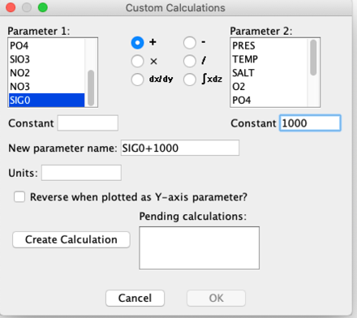
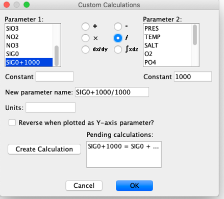
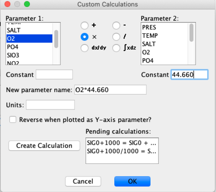
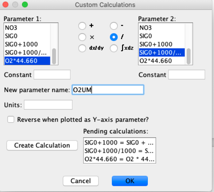
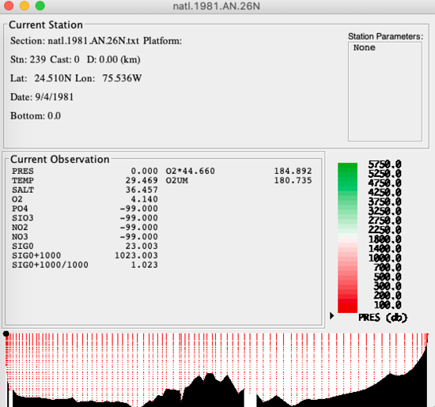
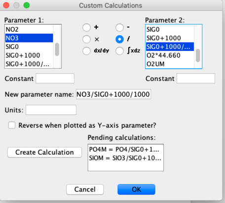

# Converting O2 in volume units (ml/l) to O2 in mass units (μMol/kg) with Java OceanAtlas Custom Calculations (and also conversion of nutrients in μmol/l to μmol/kg)

## Foreword
Prior to the World Ocean Circulation Experiment (WOCE) in the early-mid 1990s, physical oceanographers traditionally reported dissolved oxygen and nutrients data in volume units (ml/l and μmol/l, respectively), partly because these were the original units associated with the results of the measurement technologies.
During WOCE planning, on the advice of participating geochemists, oceanographers moved to reporting those data in mass units (μMol/kg)
Many older data with oxygen and nutrients in original volume units are in use and need conversion.
(The numerical difference is only ca. 2.7% for nutrient values - which potentially confuses identification of long-term nutrient changes in the oceans - but a very large, obvious ca. 45x for oxygen values.)

## Overview of the Units Conversion Calculations
To go from O2 in ml/l to O2 in μmol/kg multiply by 44.660 and divide by density in CGS.
[There is a small issue regarding what density to use, but it gets buried in the decimal place weeds.
It is best to use sigma-0, i.e. `(1000 + sigma0)/1000` in CGS.]
To go from nutrients in μmol/l to μmol/kg divide by density in CGS.
Use sigma-0 for the nutrient conversion.

## How to carry out the dissolved oxygen units conversion in Java OceanAtlas (JOA)
Open the file in JOA.

Calculate sigma-0.

Set up a sequence of calculations via the JOA Custom Calculations dialog box to do the calculation, which results in oxygen in μMol/kg (4 sequential dialog boxes shown; remember that each calculation must be finalized via "Create Calculation" to use it):

```
(O2 * 44.660)/((1000 + SIG0)/1000)
```






One will note in the final dialog box shown above that the user has chosen to name the new parameter "O2UM".
Other names could have been chosen.
The results of these sequential calculations are shown in the Data Window, including O2UM (dissolved oxygen in mass units μMol/kg):



The calculations extended across the entire data set open in the JOA Data Window.
One can then use the JOA "Export WOCE Exchange File ...", under the JOA File menu, to export a _hy1.csv exchange file which would now include the new "O2UM" parameter, then use a text editor or spreadsheet to eliminate superfluous columns, rename parameters, etc., and in general edit the new Exchange file into full compliance with WOCE/CLIVAR/GO-SHIP file format specifications.

## How to carry out the nutrients units conversion in Java OceanAtlas (JOA)

For nutrients, do this in Custom Calculations, using the `(1000+SIG0)/1000` parameter already created:

```
NUT/((1000 + SIG0)/1000)
```



The dialog box shows that two of the nutrient conversions have been finalized and that a third is being readied.
[There is little incentive to complete a conversion for NO2 (nitrite) because NO2 concentrations are so low in the oceans that a 3% units error has small potential effect.]
When the third one has been finalized by clicking on "Create Calculation", clicking on "OK" will then carry out the nutrient conversions for all data in the file(s) in the Data Window, and the results will be shown in the Data Window.
The data can be exported as noted under the discussion of the dissolved oxygen units conversion.